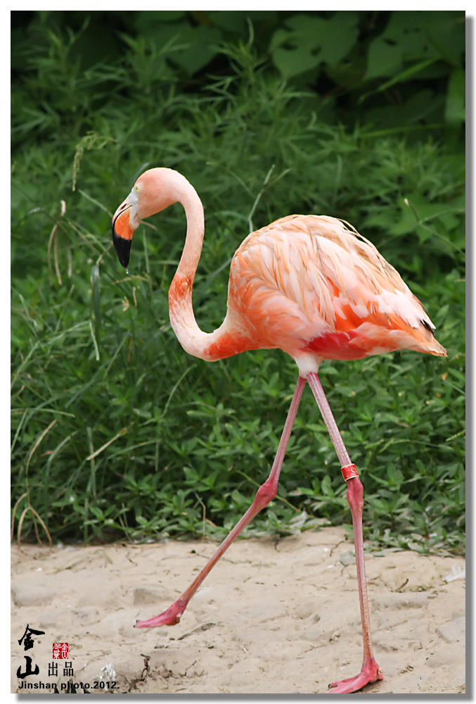
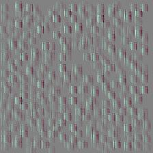
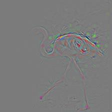

# Convolutional Neural Network Visualizations 

Links：https://github.com/STLAND-admin/ML_HKU_Proj_Pytorch_Visu

This repository contains a number of convolutional neural network visualization techniques implemented in PyTorch.

**Note**: I removed cv2 dependencies and moved the repository towards PIL. A few things might be broken (although I tested all methods), I would appreciate if you could create an issue if something does not work.

**Note**: The code in this repository was tested with torch version 0.4.1 and some of the functions may not work as intended in later versions. Although it shouldn't be too much of an effort to make it work, I have no plans at the moment to make the code in this repository compatible with the latest version because I'm still using 0.4.1.

## Implemented Techniques

* [Gradient visualization with vanilla backpropagation](#gradient-visualization)
* [Gradient visualization with guided backpropagation](#gradient-visualization) [1]
* [Gradient visualization with saliency maps](#gradient-visualization) [4]
* [Gradient-weighted class activation mapping](#gradient-visualization) [3] (Generalization of [2]) 
* [Guided, gradient-weighted class activation mapping](#gradient-visualization) [3]
* [Score-weighted class activation mapping](#gradient-visualization) [15] (Gradient-free generalization of [2])
* [Element-wise gradient-weighted class activation mapping](#hierarchical-gradient-visualization) [16]
* [Smooth grad](#smooth-grad) [8]
* [CNN filter visualization](#convolutional-neural-network-filter-visualization) [9]
* [Inverted image representations](#inverted-image-representations) [5]
* [Deep dream](#deep-dream) [10]
* [Class specific image generation](#class-specific-image-generation) [4] [14]
* [Grad times image](#grad-times-image) [12]
* [Integrated gradients](#gradient-visualization) [13]

## General Information

Depending on the technique, the code uses pretrained **AlexNet** or **VGG** from the model zoo. Some of the code also assumes that the layers in the model are separated into two sections; **features**, which contains the convolutional layers and **classifier**, that contains the fully connected layer (after flatting out convolutions). If you want to port this code to use it on your model that does not have such separation, you just need to do some editing on parts where it calls *model.features* and *model.classifier*.

Every technique has its own python file (e.g. *gradcam.py*) which I hope will make things easier to understand. *misc_functions.py* contains functions like image processing and image recreation which is shared by the implemented techniques.

All images are pre-processed with mean and std of the ImageNet dataset before being fed to the model. None of the code uses GPU as these operations are quite fast for a single image (except for deep dream because of the example image that is used for it is huge). You can make use of gpu with very little effort. The example pictures below include numbers in the brackets after the description, like *Mastiff (243)*, this number represents the class id in the ImageNet dataset.

I tried to comment on the code as much as possible, if you have any issues understanding it or porting it, don't hesitate to send an email or create an issue.

Below, are some sample results for each operation.


## Convolutional Neural Network Visualization

To visualize CNN layers is to to visualize activations for a specific input on a specific layer and filter. This was done in [1] Figure 3. Below example is obtained from layers/filters of VGG16 for the first image using guided backpropagation. The code for this opeations is in *layer_activation_with_guided_backprop.py*. The method is quite similar to guided backpropagation but instead of guiding the signal from the last layer and a specific target, it guides the signal from a specific layer and filter. 

<table border=0 width="50px" >
	<tbody> 
    <tr>		<td width="27%" align="center"> Input Image </td>
			<td width="27%" align="center"> Layer2 Vis. (Filter=0)</td>
			<td width="27%" align="center"> Layer17 Vis. (Layer=29)</td>
		</tr>
<tr>
			<td width="27%">  </td>
			<td width="27%">  </td>
			<td width="27%" align="center">  </td>
		</tr>
	</tbody>
</table>


## Requirements:
```
torch == 0.4.1
torchvision >= 0.1.9
numpy >= 1.13.0
matplotlib >= 1.5
PIL >= 1.1.7
```

## Citation

If you find the code in this repository useful for your research consider citing it.

	@misc{uozbulak_pytorch_vis_2021,
	  author = {Utku Ozbulak},
	  title = {PyTorch CNN Visualizations},
	  year = {2019},
	  publisher = {GitHub},
	  journal = {GitHub repository},
	  howpublished = {\url{https://github.com/utkuozbulak/pytorch-cnn-visualizations}},
	  commit = {53561b601c895f7d7d5bcf5fbc935a87ff08979a}
	}

## References:

[1] J. T. Springenberg, A. Dosovitskiy, T. Brox, and M. Riedmiller. *Striving for Simplicity: The All Convolutional Net*, https://arxiv.org/abs/1412.6806

[2] B. Zhou, A. Khosla, A. Lapedriza, A. Oliva, A. Torralba. *Learning Deep Features for Discriminative Localization*, https://arxiv.org/abs/1512.04150

[3] R. R. Selvaraju, A. Das, R. Vedantam, M. Cogswell, D. Parikh, and D. Batra. *Grad-CAM: Visual Explanations from Deep Networks via Gradient-based Localization*, https://arxiv.org/abs/1610.02391

[4] K. Simonyan, A. Vedaldi, A. Zisserman. *Deep Inside Convolutional Networks: Visualising Image Classification Models and Saliency Maps*, https://arxiv.org/abs/1312.6034

[5] A. Mahendran, A. Vedaldi. *Understanding Deep Image Representations by Inverting Them*, https://arxiv.org/abs/1412.0035

[6] H. Noh, S. Hong, B. Han,  *Learning Deconvolution Network for Semantic Segmentation* https://www.cv-foundation.org/openaccess/content_iccv_2015/papers/Noh_Learning_Deconvolution_Network_ICCV_2015_paper.pdf

[7] A. Nguyen, J. Yosinski, J. Clune.  *Deep Neural Networks are Easily Fooled: High Confidence Predictions for Unrecognizable  Images* https://arxiv.org/abs/1412.1897

[8] D. Smilkov, N. Thorat, N. Kim, F. Viégas, M. Wattenberg. *SmoothGrad: removing noise by adding noise* https://arxiv.org/abs/1706.03825

[9] D. Erhan, Y. Bengio, A. Courville, P. *Vincent. Visualizing Higher-Layer Features of a Deep Network* https://www.researchgate.net/publication/265022827_Visualizing_Higher-Layer_Features_of_a_Deep_Network

[10] A. Mordvintsev, C. Olah, M. Tyka. *Inceptionism: Going Deeper into Neural Networks* https://research.googleblog.com/2015/06/inceptionism-going-deeper-into-neural.html

[11] I. J. Goodfellow, J. Shlens, C. Szegedy. *Explaining and Harnessing Adversarial Examples* https://arxiv.org/abs/1412.6572

[12] A. Shrikumar, P. Greenside, A. Shcherbina, A. Kundaje. *Not Just a Black Box: Learning Important Features Through Propagating Activation Differences* https://arxiv.org/abs/1605.01713

[13] M. Sundararajan, A. Taly, Q. Yan. *Axiomatic Attribution for Deep Networks* https://arxiv.org/abs/1703.01365

[14] J. Yosinski, J. Clune, A. Nguyen, T. Fuchs, Hod Lipson, *Understanding Neural Networks Through Deep Visualization* https://arxiv.org/abs/1506.06579

[15] H. Wang, Z. Wang, M. Du, F. Yang, Z. Zhang, S. Ding, P. Mardziel, X. Hu. *Score-CAM: Score-Weighted Visual Explanations for Convolutional Neural Networks* https://arxiv.org/abs/1910.01279

[16] P. Jiang, C. Zhang, Q. Hou, M. Cheng, Y. Wei. LayerCAM: *Exploring Hierarchical Class Activation Maps for Localization* http://mmcheng.net/mftp/Papers/21TIP_LayerCAM.pdf
